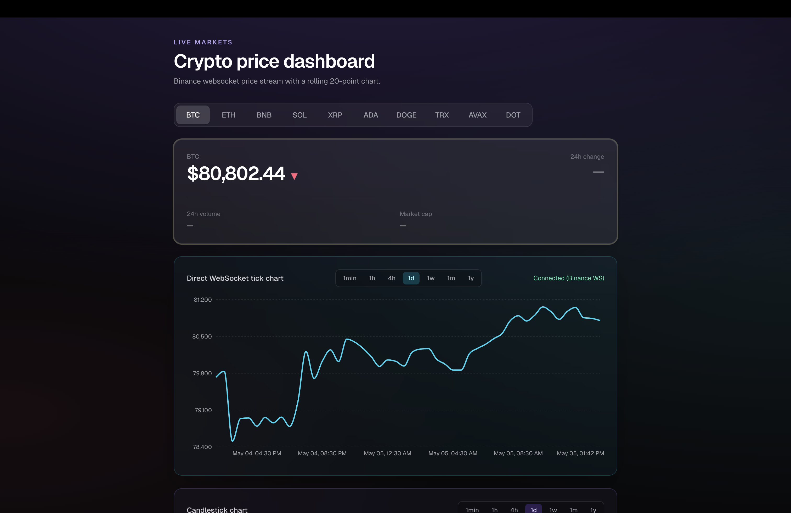
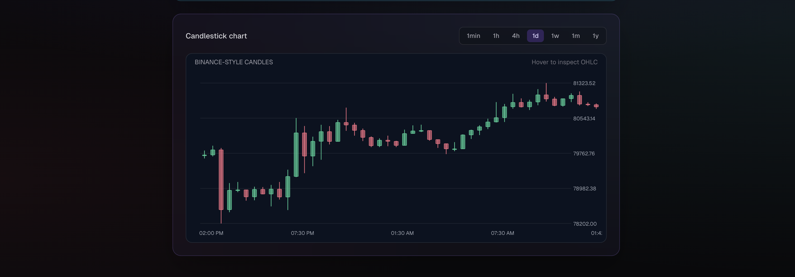

# Real-Time Crypto Price Dashboard

A production-style crypto dashboard built with Next.js App Router, TypeScript, Tailwind CSS, and Recharts.

It streams live prices directly from Binance WebSocket and renders a modern responsive chart UI.

## Preview




## Tech Stack

- Next.js (App Router)
- TypeScript
- Tailwind CSS
- Recharts
- Binance WebSocket API (direct frontend stream)

## Features

- Live token selection (`BTC`, `ETH`, `USDC`)
- Direct WebSocket stream:
  - `wss://stream.binance.com:9443/ws/${sym}@trade`
- Realtime line chart updates with smooth rendering
- Historical preload (~24h) before live ticks start
- Timeframe selector (`live`, `1m`, `5m`, `15m`)
- Auto-reconnect with retry backoff if WS disconnects
- Glassmorphism-inspired UI cards
- Mobile-friendly responsive layout

## Project Structure

```text
src/
  app/
    page.tsx
    layout.tsx
    api/crypto/route.ts
  components/
    Dashboard.tsx
    Chart.tsx
    PriceCard.tsx
    TokenSelector.tsx
    TimeframeSelector.tsx
  hooks/
    useCryptoPrice.ts
  lib/
    api.ts
    format.ts
    tokens.ts
```

## Getting Started

### 1) Install dependencies

```bash
npm install
```

### 2) Run development server

```bash
npm run dev
```

Open [http://localhost:3000](http://localhost:3000).

### 3) Build for production

```bash
npm run build
npm run start
```

## How Data Flows

1. `useCryptoPrice` preloads recent history (Binance klines).
2. Hook opens Binance WebSocket stream for the selected token pair.
3. Incoming trade ticks update:
   - current price
   - rolling chart history
4. If socket drops, hook retries automatically with backoff and alternate WS endpoint.

## Notes

- The app is WebSocket-first and reads live prices directly in the frontend.
- `src/app/api/crypto/route.ts` is intentionally disabled in current architecture.
- Market cap is not available from Binance trade stream and may be shown as unavailable in UI.

## Scripts

- `npm run dev` — start local dev server
- `npm run build` — production build
- `npm run start` — run production server
- `npm run lint` — run ESLint

## License

MIT
This is a [Next.js](https://nextjs.org) project bootstrapped with [`create-next-app`](https://nextjs.org/docs/app/api-reference/cli/create-next-app).

## Getting Started

First, run the development server:

```bash
npm run dev
# or
yarn dev
# or
pnpm dev
# or
bun dev
```

Open [http://localhost:3000](http://localhost:3000) with your browser to see the result.

You can start editing the page by modifying `app/page.tsx`. The page auto-updates as you edit the file.

This project uses [`next/font`](https://nextjs.org/docs/app/building-your-application/optimizing/fonts) to automatically optimize and load [Geist](https://vercel.com/font), a new font family for Vercel.

## Learn More

To learn more about Next.js, take a look at the following resources:

- [Next.js Documentation](https://nextjs.org/docs) - learn about Next.js features and API.
- [Learn Next.js](https://nextjs.org/learn) - an interactive Next.js tutorial.

You can check out [the Next.js GitHub repository](https://github.com/vercel/next.js) - your feedback and contributions are welcome!

## Deploy on Vercel

The easiest way to deploy your Next.js app is to use the [Vercel Platform](https://vercel.com/new?utm_medium=default-template&filter=next.js&utm_source=create-next-app&utm_campaign=create-next-app-readme) from the creators of Next.js.

Check out our [Next.js deployment documentation](https://nextjs.org/docs/app/building-your-application/deploying) for more details.
# Real-Time-Crypto-Price-Dashboard
